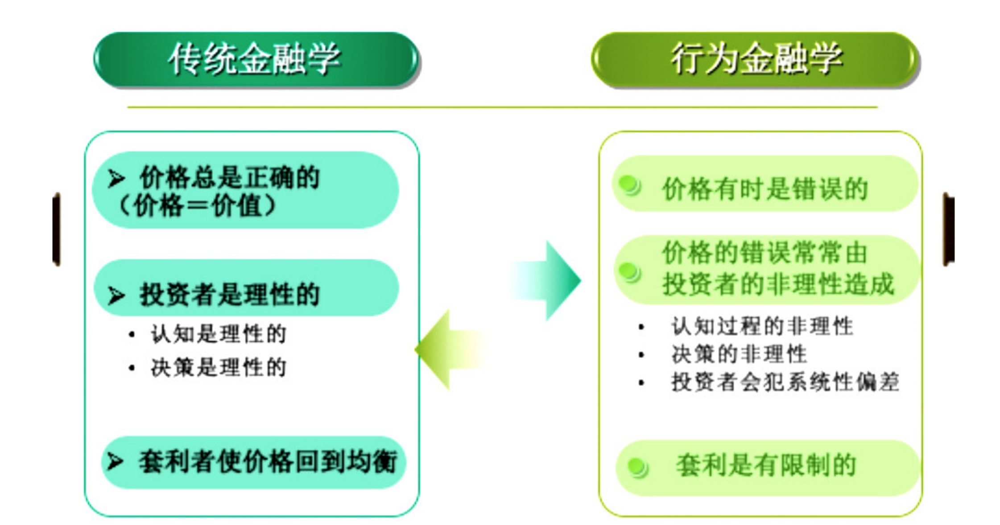

财富有两个敌人：风险和恐惧，只有知识才能对抗它们。人生何尝不是！

# 行为金融学跟传统金融学的对比

看待任何领域事物，“应该是”的视角让你把我长远基准；“实际是”的视角帮助你理解当下正在发生的事。

传统金融学，研究的是“应该是”，行为金融学，研究的是“实际是”。

有一个段子，有人惊呼地上有100元钱，传统金融学会说这不可能，地上不可能有100元钱，有的话早被捡走了。而行为金融学家说怎么不可能，他跑过去一看，果然有100元钱。

传统金融学研究的是市场“应该是”什么样的，均衡来看，地上不应该有100元钱，这是长期的趋势和规律。而行为金融学家研究的是市场“实际上”什么样。

如果金融学是一颗大树，那传统金融学跟行为金融学从根上就不同，出发点不一样，结论就大相径庭。

传统金融学认为，金融学是经济学基本理论在金融市场的展现而已，而经济学的基本假设，或者说树的根是——人是理性的。简言之，人就行机器人一样精确，机器人不会犯错，因此，任何时刻的金融资产价格都是那个时刻所有信息的准确反映。这就是经济学家尤金法玛提出的“有效市场假说”。

行为金融学认为，金融学从根本上说属于社会科学，社会科学研究的是与人相关的社会运行规律，而人的所思所想，这是心理学的研究领域。因此，行为金融学中的行为，取的是心理学中的行为主义，它是行为金融学的理论基础。

传统金融学认为市场不可预测、无法战胜；而行为金融学认为市场是有规律的、可以战胜的。

原因是，行为金融学是心理学和金融学的交叉学科，而心理学认为人的行为是有规律、可以预测。

2013年诺贝尔经济学奖颁给两位观点完全相左的学者，分别是行为金融学家罗伯特·席勒，他的代表性观点是“大盘可预测”理论，另一位是传统金融学家尤金法玛，他的代表性观点是“有效市场假说”，用这个理论来看大盘规律，大盘是不可预测。

 

 

要挑战一个学科，需要从根上着手。

传统金融学的根是有效市场假说，他的基本结论是：金融资产的价格总是正确的，行为金融学则认为，价格常常会错，会不符合价值，也就是错误定价。

传统金融学用来支撑“价格总是正确”的理论是——人是理性的。行为金融学认为，人有理性和非理性的一面，如果非理性的一面被统一了以后，心理群体的智商甚至比单个理性人的智商还要低。非理性的心理群体会产生系统性合力，在错误的路上越走越远。

传统金融学用来支撑“价格总是正确”的另一个理论是——套利。套利可以消除一切价格偏差。套利有三个条件：零成本、无风险、正收益。行为金融学认为真实市场的套利不可能零成本、无风险、正收益，真实的套利是有限套利。有限套利使得理性人不敢去套利，从而套利机会一直存在，价格错误很正常。

有限套利是行为金融学的一条腿，在套利也无法纠正价格偏差的情况下，心理学这条腿就站起来发挥作用了。

# 认知偏差

人的信息处理过程分为四个阶段：信息收集、信息加工、信息输出、信息反馈。

在信息处理的不同阶段，人都会产生认知偏差。信息收集阶段，信息的来源分为两类，当信息来源于被你记住的信息时，通常容易产生易记性偏差，也就是把熟悉当正确。当信息来源于还没有被你记住的信息时，容易受首位效应和末尾效应的影响。当两种效应都存在时，要看信息到达的速度和强度。

在信息加工阶段，最容易犯的认知错误是代表性偏差。代表性偏差指的是当事物的代表性特征表现出来后，人容易冲动做判断，而忽略了其他更多决定性错误。归根结底，这源于人们认为小样本的代表性特征就可以用来做推断。

在信息处理阶段，最容易犯的认知错误是过度自信。过度自信指的是对自己能力的认知超过了自身的实际水平。过度自信容易让人低估风险，做出不必要的买跟卖。因此减少交易次数是明智的。多站在第三方的客观立场有助于减轻过度自信的影响。

在信息反馈阶段，人的认知偏差主要有自我归因偏差、后见之明偏差、确认性偏差和神奇式思考等。正确归因、尽量用反例来思考、寻找因果证据，可以帮助你改善信息反馈阶段的偏差。

# 决策非理性

前景理论是行为金融学第一个诺奖理论，前景理论最著名的观点是，决策依赖于参考点。比如你获得一万元奖金，你是否高兴取决于你同事的奖金水平。你同事的奖金水平就是你的参考点。参考点不同，效用也不同。投资者总会将现在的价格跟成本价比，这就是在“往回看”。而理性人投资应该“往前看”，看未来。

投资者在决策时还会受到风险偏好的影响。人在盈利时讨厌风险，喜欢落袋为安，人在亏损时却厌恶风险，希望能够扳本。此外，投资者还会有损失厌恶。损失厌恶让投资者不想把损失变成既成事实，风险偏好又让投资者想搏一把，就这样，在熊市里投资者越亏越狠。要克服这些心理影响，你应该克服参考点的影响。正确的投资者应该是面向未来，忘记你的买入价位。

参考点依赖，风险偏好都会导致决策非理性，而错判概率也会导致投资失误。在低概率区域，投资者会被极端损益所吸引，在心中放大低概率，在高概率区域又会忽略大概率事件，正是因为概率到决策权重的转化非线性，同样会导致决策错误。

以上是行为金融学最著名的前景理论的全部内容。

除了前景理论，另一个获得诺奖的理论，是心理账户理论。

-------------------

作者注：

实在看不下去了。这个课程，过分抬高行为金融学，贬低传统金融学。理论很美，但高估人性，读者不要有读完就具备战胜市场的幻觉。关注投资的本质，比如何去赚更多钱更重要。
